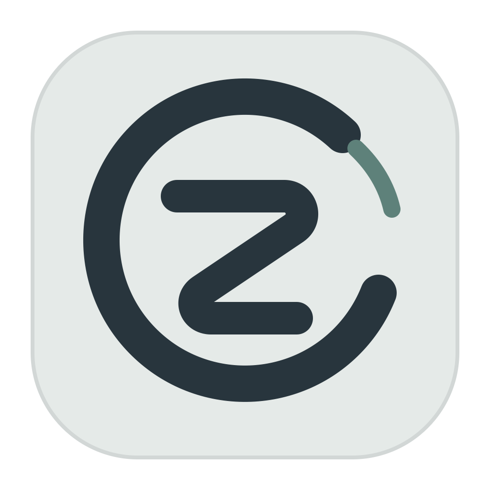
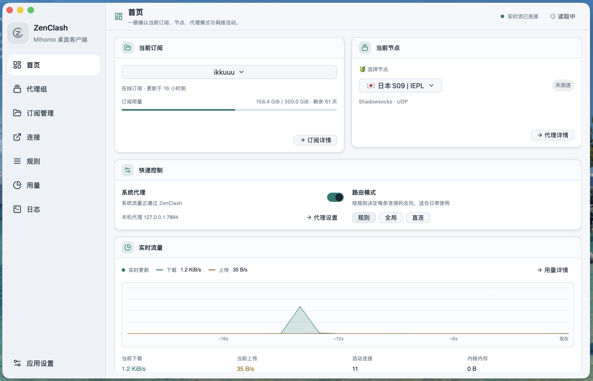

<p align="center">
  
</p>

<h1 align="center">ZenClash</h1>

<p align="center">
  简体中文
  ·
  <a href="README_en.md">English</a>
</p>

<p align="center">
  <strong>使用 Rust 与 GPUI 和 GPUI Component 构建的原生 Mihomo 桌面客户端</strong>
</p>

<p align="center">
  <a href="https://github.com/HaiwenZhang/zenclash/releases">下载</a>
  ·
  <a href="https://github.com/HaiwenZhang/zenclash/issues">问题反馈</a>
  ·
  <a href="LICENSE">GPL-3.0 许可证</a>
</p>

> [!IMPORTANT]
> ZenClash 目前仍处于早期开发阶段，界面、配置格式和部分功能可能继续调整。启用系统代理或 TUN 前，请确保已有可用的直连恢复方式。

## 首页预览



首页集中展示当前订阅、四层运行状态、当前节点、接管方式、路由模式和实时流量。一级导航只保留首页、代理组、订阅管理、连接和应用设置；规则、流量、日志及内核工具从应用设置按任务进入。

## 主要功能

- **原生桌面界面**：基于 GPUI 与 gpui-component 构建，支持浅色、深色和跟随系统主题。
- **订阅管理**：支持在线订阅与本地 Clash/Mihomo YAML，显示流量额度、更新时间和到期信息。
- **代理组与节点**：查看代理组、切换节点、执行延迟测试，并保留本地测速历史。
- **快捷控制**：在首页切换系统代理，以及规则、全局、直连三种路由模式。
- **TUN 与系统代理**：System Proxy 使用原生状态与 ownership 回读；TUN 分别显示权限、设备和路由证据，不把配置开关冒充已接管。
- **网络诊断**：独立检查 Controller、capture、DNS A/AAAA、DIRECT/Mihomo 路径与 Provider，并可复制严格脱敏的支持摘要。
- **实时监控**：查看上传、下载、活动连接、运行日志和实时流量趋势。
- **历史用量**：使用本地 SQLite 记录流量历史，并按域名、设备、出口和进程进行统计。
- **连接与规则**：查看活动连接、关闭连接、搜索规则、检查代理与规则提供者。
- **YAML 覆写**：通过有序覆写层组合配置，支持预览最终结果，且不会修改导入的源文件。
- **状态栏菜单**：显示实时上下行速度，快速切换模式、系统代理、TUN、节点和配置文件。
- **备份与恢复**：支持完整的本地 ZIP 快照导出与恢复。
- **内核管理**：Mihomo 是默认正式内核；meow-rs 作为实验选项，仅在用户明确选择时启用。
- **可验证更新**：Mihomo 在线更新要求 GitHub 发布的 SHA-256 并在启动失败时回滚；ZenClash 应用更新只通知并打开官方 Release，不静默下载或安装。

## 支持平台

| 平台 | 发布格式 | 架构 |
| --- | --- | --- |
| macOS | DMG | Apple Silicon |
| Windows | Inno Setup 安装程序 | x86_64 |
| Ubuntu 22.04 及以上 | DEB | amd64 |
| Fedora / Rocky Linux | RPM | x86_64 |

发布安装包会内置经过 SHA-256 校验的 Mihomo，不需要在首次启动时另外下载内核。Release 同时发布 `SHA256SUMS` 和 GitHub 构建来源证明。开发构建也可以连接已有的 Mihomo 控制器。

macOS 与 Linux 的 TUN 授权只会在用户显式启用 TUN 时调用系统授权，并绑定受管内核路径与摘要。Windows 不会提升整个 ZenClash GUI；在具备调用方 ACL 的按需 helper 落地前，应用内自动 TUN 授权会明确显示为不可用。

## 快速开始

1. 从 [Releases](https://github.com/HaiwenZhang/zenclash/releases) 下载对应平台的安装包。
2. 启动 ZenClash，进入「订阅管理」。
3. 添加在线订阅，或者导入本地 YAML 配置。
4. 在首页选择订阅与节点。
5. 根据需要启用系统代理或 TUN。

如果当前配置无法通过内核检查，ZenClash 会保留原始配置，并尝试使用内置的直连恢复配置启动，方便用户返回订阅管理页面修复问题。

## 从源码运行

### 环境要求

- 支持 Rust edition 2024 的当前稳定工具链
- 对应平台的原生构建工具链
- 一个真实可执行的 Mihomo 内核

指定 Mihomo 路径后运行：

```sh
ZENCLASH_MIHOMO_BINARY=/absolute/path/to/mihomo \
  cargo run -p zenclash-ui --bin zenclash
```

连接已经运行的 Mihomo 控制器：

```sh
ZENCLASH_CONTROLLER=http://127.0.0.1:9090 \
ZENCLASH_CONFIG="$PWD/platforms/common/default.yaml" \
  cargo run -p zenclash-ui --bin zenclash
```

控制器启用了鉴权时，可以同时设置：

```sh
export ZENCLASH_SECRET="your-controller-secret"
```

常用环境变量：

| 变量 | 用途 |
| --- | --- |
| `ZENCLASH_MIHOMO_BINARY` | 指定 Mihomo 可执行文件 |
| `ZENCLASH_MIHOMO_HOME` | 指定 Mihomo 工作目录 |
| `ZENCLASH_CONTROLLER` | 连接外部 Mihomo 控制器 |
| `ZENCLASH_SECRET` | 外部控制器鉴权密钥 |
| `ZENCLASH_CONFIG` | 指定启动配置文件 |
| `ZENCLASH_NETWORK_SERVICE` | 指定 macOS 网络服务名称 |
| `ZENCLASH_CORE` | 显式选择 `mihomo` 或实验性的 `meow-rs` |
| `ZENCLASH_MEOW_BINARY` | 指定 meow-rs 可执行文件 |
| `ZENCLASH_SUBSTORE_URL` | 覆盖 Sub-Store 后端地址 |
| `ZENCLASH_SUBSTORE_FRONTEND_URL` | 覆盖 Sub-Store 前端地址 |

ZenClash 不会静默切换到实验内核。只有明确选择 `meow-rs` 且提供有效二进制时，才会使用该内核运行。

## 构建安装包

### macOS

目前 macOS 发布脚本面向 Apple Silicon：

```sh
scripts/build_macos_package.sh 0.1.0 dist
```

仅构建 `.app`：

```sh
scripts/build_macos_app.sh
open target/ZenClash.app
```

### Ubuntu / Debian

```sh
sudo scripts/install_linux_build_deps.sh
scripts/build_deb_package.sh 0.1.0 dist
```

### Fedora / Rocky Linux

```sh
sudo scripts/install_linux_build_deps.sh
ZENCLASH_PACKAGE_FLAVOR=fedora44 \
  scripts/build_rpm_package.sh 0.1.0 dist
```

### Windows

在安装 Rust、Visual Studio Build Tools 和 Inno Setup 6 的 PowerShell 中运行：

```powershell
scripts/build_windows_installer.ps1 -Version 0.1.0 -OutputDir dist
```

构建脚本默认下载固定版本的官方 Mihomo，并校验发布资源提供的 SHA-256。可以通过 `MIHOMO_VERSION=vX.Y.Z` 指定其他官方版本，或者使用 `ZENCLASH_MIHOMO_BINARY` 明确提供本地内核。

## 项目结构

| 路径 | 说明 |
| --- | --- |
| `crates/zenclash-core` | Mihomo API、内核进程、系统代理、配置存储、流量和日志监控 |
| `crates/zenclash-i18n` | 简体中文与英文界面文案 |
| `crates/zenclash-ui` | GPUI 原生窗口、页面与桌面交互 |
| `platforms` | 平台配置、应用图标、默认配置和恢复配置 |
| `scripts` | macOS、Windows、DEB、RPM 构建脚本 |
| `docs` | README 截图与项目文档资源 |

## 配置与数据安全

- 导入的订阅和 YAML 源文件不会被原地改写。
- 启用的配置、覆写层和运行时设置会生成独立的托管配置。
- 活动配置被内核拒绝时，会保留原始来源并进入直连恢复流程。
- 只有显式设置 `ZENCLASH_CONTROLLER` 时，才会连接外部控制器。
- ZenClash 启动的 Mihomo 进程会在应用正常退出时同步停止。
- 流量历史默认保存在本地 SQLite 数据库中，可在设置中关闭或调整保留时间。

## 测试

运行格式检查与工作区测试：

```sh
cargo fmt --all -- --check
cargo test --workspace --all-features --locked
```

使用真实 Mihomo 运行端到端集成测试：

```sh
ZENCLASH_MIHOMO_BINARY=/absolute/path/to/mihomo \
ZENCLASH_CONFIG=/absolute/path/to/profile.yaml \
  cargo test -p zenclash-core --test real_mihomo -- --ignored --nocapture
```

该测试会启动真实 Mihomo 进程，验证版本、运行配置、代理组切换、规则、提供者、连接、流量 WebSocket、订阅下载和 YAML 覆写，不使用模拟控制器。

## 参与贡献

欢迎提交 Issue 和 Pull Request。提交代码前，请至少确保：

```sh
cargo fmt --all -- --check
cargo clippy --workspace --all-targets --all-features --locked -- -D warnings
cargo test --workspace --all-features --locked
```

报告问题时，建议附上操作系统、ZenClash 版本、Mihomo 版本、复现步骤和已脱敏的相关日志。请勿公开提交订阅地址、控制器密钥或其他凭据。

## 许可证

Copyright © 2026 Haiwen Zhang

ZenClash 采用 [GNU General Public License v3.0 only](LICENSE) 许可。
