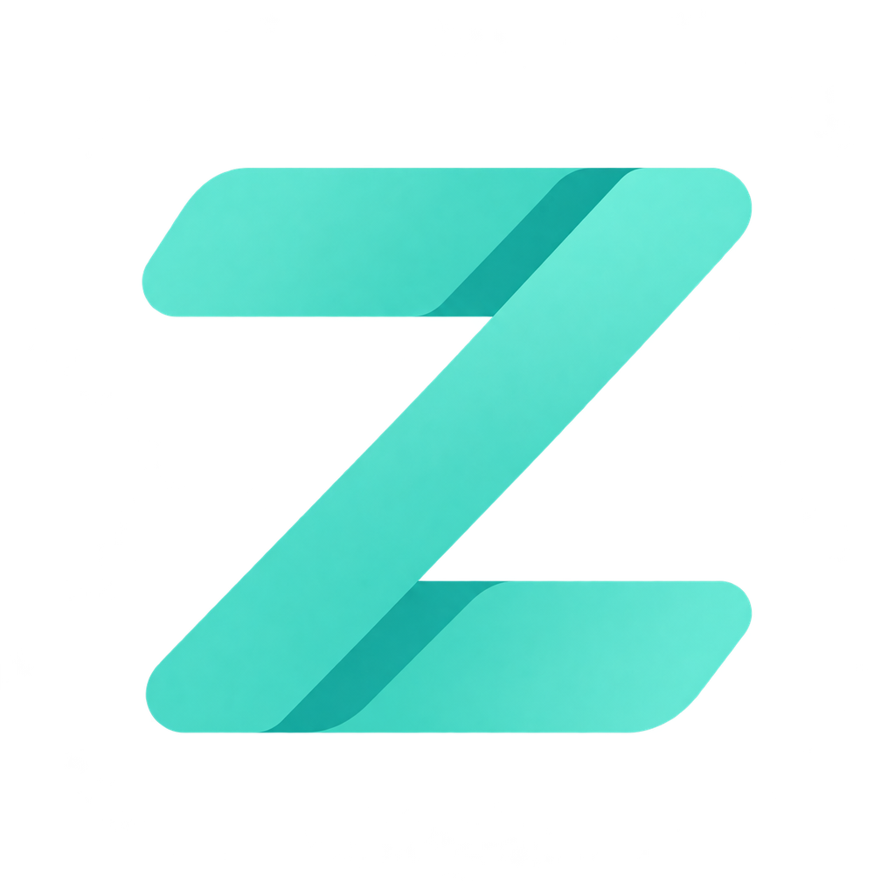
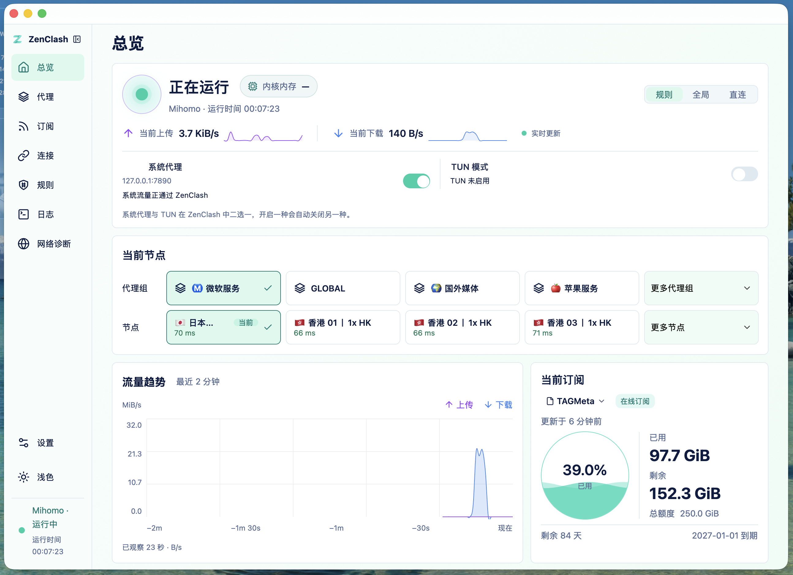

  

<h1 align="center">ZenClash</h1>

  <strong>原生 UI，为桌面而生。</strong> 
  用 Rust 和 GPUI Kit 构建的原生 Mihomo 桌面客户端 
  macOS · Windows · Linux

  
  
  
  

  <strong>项目仍处于早期开发阶段，尚未正式发布。</strong> 
  欢迎大家帮忙测试，并通过 Issue 反馈问题与建议。

  <a href="https://github.com/HaiwenZhang/ZenClash/releases">查看测试版本</a> ·
  <a href="https://github.com/HaiwenZhang/ZenClash/issues">反馈与建议</a> ·
  <a href="README_en.md">English</a>

**原生 UI，是 ZenClash 的核心特色。** 界面由 GPUI 原生绘制，使用 Rust 和 GPUI Kit 构建，把订阅、节点、流量和连接状态放在一个清晰的桌面窗口里。

添加你的订阅，选择合适的节点，开启代理，就能开始使用；想进一步调整网络行为，也可以继续配置规则、DNS 和 YAML 覆写。

## 为什么试试 ZenClash？

### 原生界面，专注桌面体验

从窗口与键盘操作，到菜单栏、托盘和主题切换，ZenClash 围绕日常桌面使用来设计。GPUI 负责界面绘制，Rust 承载界面交互与应用逻辑，让常用的代理操作在桌面上顺手完成。

### 打开首页，就知道连接怎么样

当前节点、代理模式、内核运行状态、上传下载速度和流量趋势集中呈现。订阅提供额度信息时，还能查看已用流量、剩余额度和到期时间，让日常使用心中有数。

### 节点多，也能方便地挑选

搜索节点、测试延迟、按延迟排序，或隐藏不可用节点。支持单节点与整组测速，组测速完成后统一汇总失败数量；每个节点的测试结果仍会实时更新，方便测完再选。

### 日常操作，融入你的桌面

使用原生桌面界面，支持浅色、深色与跟随系统主题，以及简体中文和英文。通过菜单栏或托盘切换节点、调整模式、查看流量，处理常用操作时无需一直打开主窗口。

### 连接有问题时，能找到线索

查看活动连接的目标、进程、匹配规则和代理链，结合日志与网络诊断排查问题。本地流量历史还能帮助你回看哪些应用、主机和出站消耗了流量。

## 从日常使用，到按需调整

| 你想做什么 | ZenClash 提供什么 |
| --- | --- |
| 管理多个订阅 | 在线订阅、本地 YAML 导入、手动更新与定时更新 |
| 选择合适的节点 | 代理组切换、节点搜索、延迟测试与排序 |
| 切换网络行为 | 规则、全局、直连模式，系统代理与 TUN |
| 查看用量 | 实时流量、订阅额度与本地流量历史 |
| 调整配置 | YAML 编辑与覆写、DNS、规则和内核设置 |
| 迁移到另一台设备 | 本地备份与恢复 |

系统代理适合日常浏览与支持系统代理的应用；TUN 可接管更多应用的网络流量，需要安装后台服务并授予系统权限。ZenClash 一次启用一种接入方式，切换时自动关闭另一种。

## 下载与开始使用

目前尚无正式 Release。欢迎前往 **[Releases 查看 ZenClash 测试版本](https://github.com/HaiwenZhang/ZenClash/releases)**，如有可用构建，请选择与你的系统和架构匹配的文件；也可以参考[开发文档](docs/development)自行构建并参与测试。

| 平台 | 架构 |
| --- | --- |
| macOS | Apple Silicon（arm64） |
| Windows | x86_64 |
| Linux | x86_64；提供 Ubuntu、Fedora 和 Rocky Linux 构建 |

发布包内置 Mihomo，应用启动时会自动发现并准备内核。安装文件的格式与系统要求以对应 Release 说明为准；macOS 用户可查看[安装指南](docs/installation/macos.md)。

**三步开始：**

1. **添加订阅**：在「订阅」中粘贴你的订阅链接，或导入本地 Clash/Mihomo YAML 文件。
2. **选择节点**：应用配置后，在「代理」中测速并选择节点。
3. **开启代理**：在「总览」启用系统代理或 TUN，按需选择规则、全局或直连模式。

ZenClash 是客户端，需要你自行提供订阅或代理配置。项目正在持续迭代，具体功能与平台兼容性请查看所用版本的发布说明。

## 你的配置，留在你的掌控中

导入的 YAML 源文件不会被原地改写，调整可以通过配置覆写完成。流量历史保存在本地，记录开关与保留时间可在设置中调整；配置与偏好也可以备份和恢复。

在 macOS 上，关闭主窗口后可继续通过菜单栏使用 ZenClash；需要结束运行时，从菜单中选择「退出」。正常退出会释放应用接管的代理并停止它启动的内核。

## 一起把 ZenClash 做得更好

如果你喜欢这样的桌面代理体验，欢迎给项目一个 **Star**，也欢迎分享给正在寻找 Mihomo 客户端的朋友。

用起来有不顺手的地方？欢迎提交 [Issue](https://github.com/HaiwenZhang/ZenClash/issues)，告诉我们你的使用场景与期望。报告故障时，请附系统和应用版本、复现步骤，以及脱敏后的日志。

想参与开发，可以从[开发文档](docs/development)、[构建与打包脚本](scripts)和 [CI 检查](.github/workflows/ci.yml)开始。欢迎提交 Pull Request，改进功能、交互、翻译和文档。

## 致谢与许可

感谢 [Mihomo](https://github.com/MetaCubeX/mihomo)、[GPUI](https://github.com/zed-industries/zed/tree/main/crates/gpui)、[GPUI Kit](https://github.com/longbridge/gpui-kit)，以及本项目使用和参考的开源项目的作者与贡献者。

ZenClash 采用 [GPL-3.0-only](LICENSE) 许可证。Copyright © 2026 Haiwen Zhang and ZenClash contributors.

第三方代码的来源与修改声明见 [NOTICE](NOTICE.md) 和[服务说明](crates/zenclash-service/README.md)；对应源码与再分发说明见 [GPL 分发文档](docs/development/gpl-distribution.md)。
