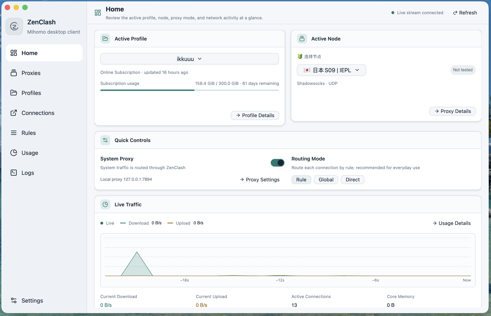

<p align="center">
  
</p>

<h1 align="center">ZenClash</h1>

<p align="center">
  <a href="README.md">简体中文</a>
  ·
  English
</p>

<p align="center">
  <strong>A native Mihomo desktop client built with Rust, GPUI and GPUI Component</strong>
  <br>
</p>

<p align="center">
  <a href="https://github.com/HaiwenZhang/zenclash/releases">Download</a>
  ·
  <a href="https://github.com/HaiwenZhang/zenclash/issues">Report an issue</a>
  ·
  <a href="LICENSE">GPL-3.0 License</a>
</p>

> [!IMPORTANT]
> ZenClash is still in early development. The interface, configuration format, and some features may continue to change. Before enabling the system proxy or TUN, make sure you have a working direct-connect recovery path.

## Home Preview



The home page brings together the active profile, four-layer operational status, selected node, capture mode, routing mode, and live traffic. Primary navigation is limited to Home, Proxies, Profiles, Connections, and Settings; rules, traffic, logs, and core tools are reached from Settings by task.

## Features

- **Native desktop interface**: Built with GPUI and gpui-component, with light, dark, and system appearance modes.
- **Profile management**: Supports online subscriptions and local Clash/Mihomo YAML files, including traffic quota, update time, and expiration information.
- **Proxy groups and nodes**: Browse proxy groups, switch nodes, run delay tests, sort by latency, hide unavailable nodes, and retain local test history.
- **Quick controls**: Toggle the system proxy and switch between Rule, Global, and Direct routing modes from the home page.
- **TUN and system proxy**: Native System Proxy state and ownership readback, plus separate TUN permission, device, and route evidence so a configured switch is never presented as proven capture.
- **Network diagnostics**: Independently checks the controller, capture, DNS A/AAAA, DIRECT/Mihomo paths, and providers, with a strictly redacted support summary.
- **Live monitoring**: Inspect upload, download, active connections, runtime logs, and real-time traffic trends.
- **Traffic history**: Stores history in a local SQLite database and aggregates usage by domain, device, outbound, and process.
- **Connections and rules**: Inspect and close active connections, filter by TCP/UDP, sort by time or traffic, search rules, and review proxy and rule providers.
- **YAML overrides**: Compose configurations through ordered override layers, preview the effective result, and leave imported source files untouched.
- **Status bar menu**: Shows live upload and download rates with quick access to routing mode, system proxy, TUN, nodes, and profiles.
- **Backup and restore**: Supports exporting and restoring complete local ZIP snapshots.
- **Core management**: Mihomo is the default production core. meow-rs is experimental and is used only when selected explicitly.
- **Verifiable updates**: Mihomo updates require the GitHub-published SHA-256 and roll back after a failed start. ZenClash application updates only notify and open the official Release page; they never download or install silently.

## Supported Platforms

| Platform | Package | Architecture |
| --- | --- | --- |
| macOS | DMG | Apple Silicon |
| Windows | Inno Setup installer | x86_64 |
| Ubuntu 24.04 and newer | DEB | amd64 |
| Fedora / Rocky Linux | RPM | x86_64 |

Release packages bundle a Mihomo binary whose SHA-256 digest is verified during the build, so no additional core download is required on first launch. Releases also publish `SHA256SUMS` and GitHub build attestations. Development builds may connect to an existing Mihomo controller.

On macOS and Linux, the native authorization flow runs only after an explicit TUN action and binds the managed core path to its digest. Windows never elevates the whole ZenClash GUI; until an on-demand helper with caller ACLs exists, in-app automatic TUN authorization is explicitly unavailable.

## Quick Start

1. Download the package for your platform from [Releases](https://github.com/HaiwenZhang/zenclash/releases). macOS users should read the [macOS installation guide](docs/installation/macos_en.md) first.
2. Start ZenClash and open **Profiles**.
3. Add an online subscription or import a local YAML configuration.
4. Select a profile and node from the home page.
5. Enable the system proxy or TUN when needed.

If the current configuration fails core validation, ZenClash keeps the original source and attempts to start with the bundled direct-only recovery profile, allowing you to return to profile management and fix the problem.

## Automatic Runtime Maintenance

- When two consecutive observations find no available non-tunnel uplink, ZenClash pauses its managed core and releases its owned system proxy. When the network returns, it starts the core with the retained TUN configuration and reconciles system proxy intent. Failed observations are unknown; website, DNS, and controller request failures do not count as link loss.
- A core stopped manually in Core Management stays stopped when connectivity returns. Use Restart to start it again. Quitting cancels automatic recovery.
- Background checks inspect the active configuration and enabled YAML overrides every second. Effective changes stable across two observations are validated and applied by restarting the core. Comments, formatting, and content already applied by the app do not trigger repeated restarts. Validation failure preserves the current core; startup failure uses the existing rollback workflow.
- External controllers are never automatically stopped or restarted. Imported local configurations follow the managed-copy convention: monitoring targets the active managed source, not the original import path.
- Pages, the tray, and historical accounting share connection snapshots for up to one second. Closing connections and core transitions invalidate the snapshot. Traffic and log streams reconnect with exponential backoff and jitter, capped at 20 seconds.

See [automatic runtime validation](docs/development/automatic-runtime-validation.md) for implementation details and repeatable manual checks.

## Controllers, Wi-Fi Rules and the Menu Bar Panel

- Use **Controllers and Wi-Fi rules** at the top of the window to add, edit, test and switch remote Mihomo controllers. Switching probes the version and runtime configuration first and preserves the previous connection on failure. Deleting the selected controller returns to local. Startup attempts to restore the last successfully selected target.
- Each remote session owns its client, connection cache, traffic and logs; switching releases the previous session. Remote pages provide proxies, connections, logs and rules. The local core, system proxy, TUN and profiles remain independently managed. Remote traffic and logs are not written to local history.
- On macOS, map an exact SSID to a local profile. Rules default to off and require system location permission to read Wi-Fi names; location data is not collected. Use the packaged `ZenClash.app`; command-line binaries display a missing application permission declaration message. Native SSID/link events trigger refreshes with a 30-second fallback check. Two stable observations trigger one attempt per association. Unknown SSIDs, missing profiles, a manually stopped core or a remote target do not cause repeated switching.
- Left-click the menu bar icon to open the local panel; right-click retains the native menu. Linux trays do not provide click events; use **Open status panel** in the native menu instead. The panel shows traffic and provides mode, profile, proxy-node, system proxy and TUN controls. Escape or loss of focus closes it. Large proxy groups link to the main window for more nodes.
- `controllers.json` and `ssid-rules.json` live separately in the app data directory; existing preferences require no migration. Current configuration backups do not include these two new files. Controller secrets are stored as plaintext with `0600` file permissions on Unix and redacted from diagnostics. Do not share these files. Corrupt or unsupported files report errors and remain intact.

See [controller and panel validation](docs/development/controller-panel-validation.md) for platform acceptance steps and verification limits.

## Run from Source

### Requirements

- A current stable toolchain with Rust edition 2024 support
- The native build toolchain for your platform
- A real Mihomo executable

Run with an explicit Mihomo binary:

```sh
ZENCLASH_MIHOMO_BINARY=/absolute/path/to/mihomo \
  cargo run -p zenclash-ui --bin zenclash
```

Connect to an already-running Mihomo controller:

```sh
ZENCLASH_CONTROLLER=http://127.0.0.1:9090 \
ZENCLASH_CONFIG="$PWD/platforms/common/default.yaml" \
  cargo run -p zenclash-ui --bin zenclash
```

If the controller requires authentication, also set:

```sh
export ZENCLASH_SECRET="your-controller-secret"
```

Common environment variables:

| Variable | Purpose |
| --- | --- |
| `ZENCLASH_MIHOMO_BINARY` | Path to the Mihomo executable |
| `ZENCLASH_MIHOMO_HOME` | Mihomo working directory |
| `ZENCLASH_CONTROLLER` | Connect to an external Mihomo controller |
| `ZENCLASH_SECRET` | External controller authentication secret |
| `ZENCLASH_CONFIG` | Startup configuration file |
| `ZENCLASH_NETWORK_SERVICE` | Select a macOS network service |
| `ZENCLASH_CORE` | Explicitly select `mihomo` or experimental `meow-rs` |
| `ZENCLASH_MEOW_BINARY` | Path to the meow-rs executable |
| `ZENCLASH_SUBSTORE_URL` | Override the Sub-Store backend URL |
| `ZENCLASH_SUBSTORE_FRONTEND_URL` | Override the Sub-Store frontend URL |

ZenClash never switches silently to an experimental core. meow-rs is used only when it is selected explicitly and a valid binary is available.

## Build Installers

The top of Settings shows the ZenClash version, bundled Mihomo version, and running core version. All packaging scripts inject the package version and the actual Mihomo executable’s `-v` output. The running version comes from the API and is unavailable while stopped or offline. Direct Cargo builds use the workspace version and indicate that bundle metadata was not provided.

### macOS

The current macOS release script targets Apple Silicon:

```sh
scripts/build_macos_package.sh 0.1.0 dist
```

Build the `.app` bundle only:

```sh
scripts/build_macos_app.sh
open target/ZenClash.app
```

### Ubuntu / Debian

```sh
sudo scripts/install_linux_build_deps.sh
scripts/build_deb_package.sh 0.1.0 dist
```

### Fedora / Rocky Linux

```sh
sudo scripts/install_linux_build_deps.sh
ZENCLASH_PACKAGE_FLAVOR=fedora44 \
  scripts/build_rpm_package.sh 0.1.0 dist
```

### Windows

Run the following in PowerShell after installing Rust, Visual Studio Build Tools, and Inno Setup 6:

```powershell
scripts/build_windows_installer.ps1 -Version 0.1.0 -OutputDir dist
```

By default, the build scripts download a pinned official Mihomo release and verify the SHA-256 digest published with the asset. Set `MIHOMO_VERSION=vX.Y.Z` to use another official version, or provide a local core explicitly with `ZENCLASH_MIHOMO_BINARY`.

## Project Structure

| Path | Description |
| --- | --- |
| `crates/zenclash-core` | Mihomo API, managed core process, system proxy, configuration storage, traffic and log monitoring |
| `crates/zenclash-i18n` | Simplified Chinese and English interface copy |
| `crates/zenclash-ui` | Native GPUI windows, pages, and desktop interactions |
| `platforms` | Platform metadata, application icons, bootstrap profile, and recovery profile |
| `scripts` | macOS, Windows, DEB, and RPM build scripts |
| `docs` | README screenshots and project documentation assets |

## Configuration and Data Safety

- Imported subscriptions and YAML source files are never rewritten in place.
- Active profiles, override layers, and runtime settings are materialized into a separate managed configuration.
- If the core rejects the active configuration, the original source is preserved and ZenClash enters the direct-connect recovery flow.
- ZenClash connects to an external controller after `ZENCLASH_CONTROLLER` is explicitly set or a target is added and selected in the controller interface. Saved targets are retried on the next startup.
- A Mihomo process started by ZenClash is stopped when the application exits normally.
- Traffic history is stored in a local SQLite database and can be disabled or given a custom retention period in Settings.

## Testing

Run formatting checks and workspace tests:

```sh
cargo fmt --all -- --check
cargo test --workspace --all-features --locked
```

Run the end-to-end integration test with a real Mihomo process:

```sh
ZENCLASH_MIHOMO_BINARY=/absolute/path/to/mihomo \
ZENCLASH_CONFIG=/absolute/path/to/profile.yaml \
  cargo test -p zenclash-core --test real_mihomo -- --ignored --nocapture
```

This test launches a real Mihomo process and verifies version reporting, runtime configuration, proxy-group switching, rules, providers, connections, the traffic WebSocket, subscription downloads, and YAML overrides. It does not use a mock controller.

## Contributing

Issues and pull requests are welcome. Before submitting code, please run at least:

```sh
cargo fmt --all -- --check
cargo clippy --workspace --all-targets --all-features --locked -- -D warnings
cargo test --workspace --all-features --locked
```

When reporting a problem, include the operating system, ZenClash version, Mihomo version, reproduction steps, and relevant redacted logs. Do not publish subscription URLs, controller secrets, or other credentials.

## License

Copyright © 2026 Haiwen Zhang

ZenClash is licensed under the [GNU General Public License v3.0 only](LICENSE).
