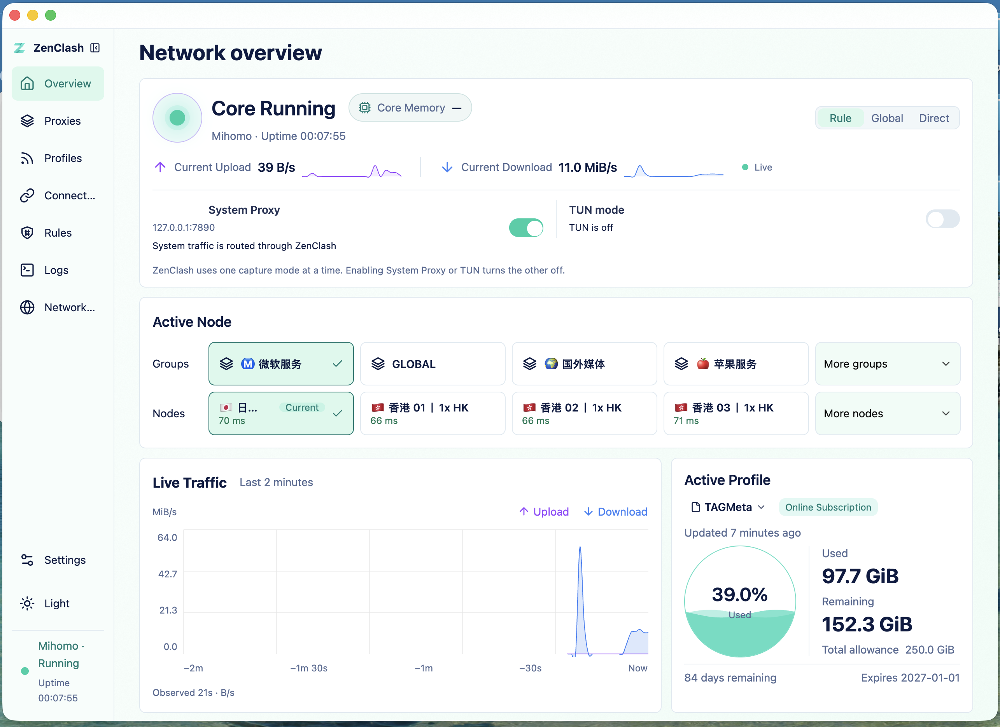

  

<h1 align="center">ZenClash</h1>

  <strong>Native UI. Built for the desktop.</strong> 
  A native Mihomo desktop client built with Rust and GPUI Kit 
  macOS · Windows · Linux

  <a href="https://github.com/HaiwenZhang/ZenClash/releases">Download ZenClash</a> ·
  <a href="https://github.com/HaiwenZhang/ZenClash/issues">Feedback and ideas</a> ·
  <a href="README.md">简体中文</a>

**Native UI is at the heart of ZenClash.** Its interface is rendered natively by GPUI and built with Rust and GPUI Kit, bringing your profiles, proxy nodes, traffic, and connection status into one desktop window.

Add a profile, choose a node, and turn on your proxy. When you want more control, explore rules, DNS settings, and YAML overrides.

## Why try ZenClash?

### A native interface designed for desktop use

Windows, keyboard controls, the menu bar, system tray, and theme switching are designed around everyday desktop use. GPUI renders the interface, while Rust handles UI interactions and application logic, keeping your regular proxy controls close at hand.

### See your connection at a glance

The overview brings together your active node, routing mode, core status, transfer speeds, and traffic trends. When your subscription provides usage information, you can also see used traffic, remaining allowance, and expiry dates.

### Find a node that works for you

Search nodes, measure latency, sort results, or hide unavailable nodes. Test one node or an entire group. Results update as each node finishes, with failures reported together when the group is done.

### Make it part of your desktop

A native desktop interface with light, dark, and system appearance, in Simplified Chinese or English. Use the menu bar or system tray to switch nodes, change modes, and check traffic without keeping the main window open.

### Follow the clues when a connection fails

Inspect connection destinations, processes, matched rules, and proxy chains. Use logs and network diagnostics to investigate problems, and local traffic history to review usage by application, host, and outbound route.

## Everyday controls, with room to customize

| What you want to do | What ZenClash offers |
| --- | --- |
| Manage multiple profiles | Subscription URLs, local YAML imports, manual and scheduled updates |
| Choose a proxy node | Group switching, node search, latency testing, and sorting |
| Change routing behavior | Rule, Global, and Direct modes; system proxy and TUN |
| Review usage | Live traffic, subscription allowance, and local traffic history |
| Customize your setup | YAML editing and overrides, DNS, rules, and core settings |
| Move to another device | Local backup and restore |

The system proxy works with browsers and applications that follow system proxy settings. TUN can capture traffic from more applications and requires the background service and system permissions. ZenClash uses one capture mode at a time, turning the other off when you switch.

## Download and get started

Visit **[Releases to download ZenClash](https://github.com/HaiwenZhang/ZenClash/releases)** and choose a build for your system and architecture.

| Platform | Architecture |
| --- | --- |
| macOS | Apple Silicon (arm64) |
| Windows | x86_64 |
| Linux | x86_64; builds for Ubuntu, Fedora, and Rocky Linux |

Release packages include Mihomo. ZenClash discovers and prepares the core at startup. Check the release notes for package formats and system requirements. macOS users can follow the [installation guide](docs/installation/macos_en.md).

**Three steps to get connected:**

1. **Add a profile:** paste your subscription URL in **Profiles**, or import a local Clash/Mihomo YAML file.
2. **Choose a node:** apply the profile, then test and select a node in **Proxies**.
3. **Turn on your proxy:** enable the system proxy or TUN in **Overview**, and choose Rule, Global, or Direct mode.

ZenClash is a client; bring your own subscription or proxy configuration. The project is under active development. Check the notes for your release for feature availability and platform compatibility.

## Keep control of your configuration

Imported YAML source files are preserved; customize your setup through overrides. Traffic history stays on your device, with recording and retention controls in Settings. Back up and restore your configuration and preferences when needed.

On macOS, closing the main window leaves ZenClash available in the menu bar. Choose **Quit** from the menu when you want to stop it. A normal quit releases the proxy settings managed by ZenClash and stops the core it started.

## Help shape ZenClash

If this is the desktop proxy experience you have been looking for, give the project a **Star** and share it with someone who uses Mihomo.

Have an idea or something that feels awkward? Open an [Issue](https://github.com/HaiwenZhang/ZenClash/issues) and tell us about your workflow. For bug reports, include system and app versions, reproduction steps, and redacted logs.

To contribute code, start with the [development notes](docs/development), [build and packaging scripts](scripts), and [CI checks](.github/workflows/ci.yml). Pull requests for features, interactions, translations, and documentation are welcome.

## Acknowledgments and license

Thanks to the authors and contributors of [Mihomo](https://github.com/MetaCubeX/mihomo), [GPUI](https://github.com/zed-industries/zed/tree/main/crates/gpui), [GPUI Kit](https://github.com/longbridge/gpui-kit), and the open-source projects used and referenced by ZenClash.

ZenClash is licensed under [GPL-3.0-only](LICENSE). Copyright © 2026 Haiwen Zhang and ZenClash contributors.

See [NOTICE](NOTICE.md) and the [service documentation](crates/zenclash-service/README.md) for third-party provenance and modifications, and the [GPL distribution notes](docs/development/gpl-distribution.md) for corresponding source and redistribution details.
