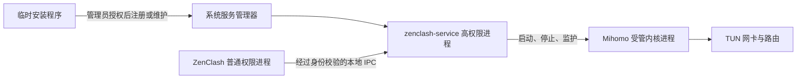

# 三平台 TUN 服务开发计划

- 制定日期：2026-10-01。
- 修订日期：2026-10-03。
- 方案状态：采用三平台独立 ZenClash 服务，开发方式调整为优先移植 `examples/clash-verge-service-ipc` 的有用代码，再适配当前实现；本文是实施计划，不代表移植或功能已经完成。
- 目标平台：Windows、macOS、使用 systemd 的 Linux 发行版。
- 交付目标：首次开启 TUN 时安装并授权服务，安装成功后自动完成开启；后续普通权限启动 ZenClash 即可直接开关 TUN。

2026-10-03 用户调整当前开发优先级：先实施 GUI 修复/卸载与恢复、本地 TUN 配置准入、缓存与身份持久化、旧服务迁移与内核升级；其他事项暂缓。用户已确认本地最终有效 TUN 配置进入授权与服务交接流程，成功后再应用，不能以“只拒绝并提示”代替该行为。配置候选及其资源须先准备并验证，授权取消和交接失败保留原进程/配置；后续批次复用现有捕获与配置完成任务，覆盖退出与失败恢复。新持久化目录和迁移影响随具体批次明确记录，不将此前提案直接报告为已完成。

当前仍处于开发阶段，P0–P6 的整体完成标记保持未勾选。服务、配置事务、唯一 owner 生命周期和部分配置事务已有分阶段实现与验证；开发继续采用移植上游有用代码后适配 ZenClash 的方式。最新证据见 [实施记录](tun-service-progress.md)，实际来源见 [UPSTREAM.md](../../crates/zenclash-service/UPSTREAM.md)。

- 首次安装并开启 TUN 已接通页面确认弹窗与托盘，收据分类修复已通过第二轮审查；Windows 完整 UI 库 294 项、UI binary 11 项通过，core/UI check 和标准严格 clippy 通过。UI 的完整 CI 附加 lint 仍有五项问题，真实窗口验收尚未完成。
- main/UI 服务优先选择和初始化收据接线的首审 P1/P2 已修复并通过第二轮审查；Windows 完整 core 534 通过/0 失败/2 忽略、Linux 完整 core 577 通过/0 失败/2 忽略，初始化 9 项、ProfileService 14 项及 i18n 4 项通过。Linux core all-targets/all-features check 和完整 CI 严格 lint 通过。随后用户确认无 owner 启动保持退出，仅改进错误提示；真实服务启动尚未验收，最新提示批次见实施记录。
- Windows、Linux 普通权限下真实 Mihomo 自动生命周期分别 2 项通过，两平台已在启动修复后复验。WSL 普通用户下 Linux 服务库 176 项及执行文件检查 4 项通过；两项 Unix 更新回滚夹具同步问题已修复并通过独立首审，更新模块 19 通过/2 忽略、启动相关 29 项通过。这些结果不覆盖真实高权限服务或 TUN；macOS core 仍缺 C 工具链。
- Windows SCM 注册身份与 owner/DACL 校验已移植适配，新增 11 项行为通过，完整 Windows service 209 项通过；check、完整 CI 严格 lint、Linux/macOS service 交叉 check 与首次独立审查通过。真实 release helper 已构建并通过版本检查；这些结果不代替 SCM、安装包或 TUN 验收。
- 首页 TUN 的统一服务命令阶段已收尾。P3 日志等级与格式已贯通，阶段验证见 §7.5；§7.3 维护原子准入已获确认并进入开发。Managed Local Mihomo 的最终有效配置 TUN 准入和 Linux/macOS 有效注册归属仍待收尾。按已确认的退出策略改进启动提示，继续修复/卸载、高层缓存保存、跨会话状态与旧权限迁移，最后进行三平台安装、TUN、失败恢复及发布验收。
- 维护准入仍有缺口：worker 的 `.maintenance.lock` 只互斥维护进程，当前服务端只检查 journal，不能据此宣称已经冻结新会话；获锁后暂存到 journal 发布前，以及没有 journal 的卸载分支，仍需原子准入与实际 owner 核验。普通权限预检或延长 lease 不能代替该门栓。
- Linux/macOS 原生注册归属还需补齐：固定 unit/job 名称及受保护目录不证明实际加载的服务属于 ZenClash。维护前核对实际执行路径、参数、账户及有效注册；查询失败保持未知，不能视为不存在后停止、覆盖或删除同名外部注册。上游 macOS 查询分类已复用，完整归属校验仍需适配实现。
- macOS 查询分类已移植并接 start/stop/unregister，未知结果零操作；Windows 分类/调度 10 项、普通 Linux 整组 16 项、check/完整 CI lint 与首审通过，真实 launchd 及有效注册归属尚待完成。首页 TUN 统一服务命令与待确认反馈的 P2 修复通过第二轮审查，完整 Windows UI 299 项通过；随后四行详情导航收尾的 Home 5 项、service_tun 7 项、UI check/标准严格 lint/fmt 通过。完整 CI 附加 lint 仍有旧五项问题，真实窗口及三平台 TUN 未验收。
- macOS 固定 plist 的副作用前置检查已收尾：修后 Windows 11 项、普通 Linux 14 项及完整 Windows service 230 项通过，check/完整 CI lint/fmt 与首次独立审查 PASS（1/2）。该检查覆盖维护入口和每次原生效果，保留未知文件；完整 loaded-job 执行归属仍未实现，不能据固定模板一致批准接管同名外部任务。公开接口研究与原生验证要求见 [macOS 查询研究](tun-service-macos-registration-research.md)，尚无可靠证明 inactive job 完整账户/参数的受支持接口证据。

- 最新 Windows workspace 全目标/全 feature check 与完整 tests 均退出 0，包含首页导航尾修；真实内核集成仍默认忽略，完整 CI lint 与三平台实机验收仍未完成。该联合回归早于随后 Windows runtime 删除竞争重试批次，详见实施记录。

- Windows runtime 删除竞争重试已移植适配：实际红 1 通过/2 失败，修后相关 7 项、完整 service 237 项通过，check/完整 CI lint/fmt、Linux/macOS service 交叉 check 与首次独立审查 PASS（1/2）。一次清理波次共用三次等待及 175ms 累计 sleep，失败保留清理所有者与共享资源；原子替换重试已在后续独立批次验证，原生服务维护验收仍待完成。

- Windows runtime 原子替换重试已完成本批适配：实际源/目标占用红绿、相关 15 项与完整 service 252 项通过，check/完整 CI lint/fmt、Linux/macOS service 交叉 check 通过。首审查询错误被当不存在的 P2 已修复，第二轮最终 PASS（2/2）；临时内容只写一次，shared wave 预算与失败保留路径已有回归，真实服务及 Mihomo 占用验收仍未完成。

- Unix rename 后父目录打开失败的真实普通权限回归已补充：专项 1 项、当前 Linux 完整 service 207 项通过，Windows/macOS check/完整 CI lint 及新验证批次首审 PASS（1/2）。仅为文件系统边界证据，不覆盖 sync_all syscall 故障、macOS 原生服务或 TUN；当前三平台交付仍未完成。

## 1. 范围与可观察目标

用户体验参考 Clash Verge Rev，服务实现优先复用本地上游源码，界面继续使用本项目的 GPUI Kit 组件和现有信息结构。服务使用独立的 ZenClash 名称、目录和通信端点，与用户已经安装的 Clash Verge 共存。具体源码入口、适配要求和实施顺序见 [上游代码移植计划](tun-service-upstream-migration.md)。

| 场景 | 预期行为 |
| --- | --- |
| 首次开启 TUN，服务未安装 | 显示安装说明；用户选择安装后进入系统授权流程 |
| 安装和启动成功 | 切换到服务托管的 Mihomo，继续此前的开启操作，回读网卡和路由状态 |
| 再次开启 TUN | 服务健康且内核版本已获授权时，无须重复提权 |
| 首次安装并开启时取消授权 | 结束本次开启请求，保留原来的捕获模式，不反复弹出授权框 |
| 服务损坏、停止或协议不兼容 | 显示准确状态及启动、修复或重装入口，不显示为 TUN 已开启 |
| 关闭 TUN | 关闭虚拟网卡捕获，服务可以继续待命；关闭 TUN 不等于卸载服务 |
| 卸载服务 | 先停止服务托管的内核并释放相关捕获，再卸载；需要时恢复普通模式内核 |
| 正常退出或重启 ZenClash | 等待当前受管内核停止；退出过程禁止旧任务重新启动内核 |
| ZenClash 异常结束 | 服务识别会话所有者消失，在有界时间内停止其内核并释放 TUN |
| 系统重启 | 服务可由系统启动待命；只有有效应用会话才能启动内核，服务不自行恢复代理 |

本次正式支持 Mihomo。meow-rs 继续保持实验后端的真实能力边界；连接外部控制器时，不接管或提权外部内核。Linux 首期要求 systemd；缺少 systemd 或 Polkit 授权代理时应给出明确说明和文档入口。

## 2. 规划基线与接入点

本节记录服务方案实施前的基线，不代表工作区当前进度。实施状态与验证证据另见 [实施记录](tun-service-progress.md)，core 调用点与接入事务见 [core 接入文档](tun-service-core-integration.md)。阶段完成情况以验收证据为准。

| 现有实现 | 状态与接入点 |
| --- | --- |
| [Windows TUN 权限](../../crates/zenclash-core/src/tun_permissions/windows.rs) | 只检测当前进程是否为管理员，尚无可请求的受限 helper |
| [Linux TUN 权限](../../crates/zenclash-core/src/tun_permissions/linux.rs) | 通过 `pkexec` 把内核改为 root 所有并设置 setuid |
| [macOS TUN 权限](../../crates/zenclash-core/src/tun_permissions/macos.rs) | 通过管理员授权脚本把内核改为 root 所有并设置 setuid |
| [内核会话](../../crates/zenclash-core/src/core_session.rs) | `CoreSession` 串行管理配置、重启、恢复和退出，持有本地 `MihomoProcess` |
| [进程管理](../../crates/zenclash-core/src/process.rs) | 本地子进程启动、停止、就绪等待、日志缓冲与退出状态 |
| [捕获模式事务](../../crates/zenclash-core/src/traffic_capture.rs) | `TrafficCaptureCoordinator` 协调系统代理、TUN、权限与失败回滚 |
| [配置事务](../../crates/zenclash-core/src/controlled_config.rs) | 运行时配置生成、校验、应用和回滚；必须保持订阅源文件不变 |
| [运行状态](../../crates/zenclash-core/src/operational_status.rs)、[TUN 回读](../../crates/zenclash-core/src/tun_runtime.rs) | 区分请求、配置、权限、实际设备和路由，不能只依据 `tun.enable` 报告成功 |
| [控制器地址](../../crates/zenclash-core/src/endpoint.rs)、[请求层](../../crates/zenclash-core/src/client/request.rs) | 当前为 HTTP(S)/WebSocket；服务模式需核对控制器权限与配置入口 |
| [TUN 页面](../../crates/zenclash-ui/src/pages/runtime/tun.rs)、[首页](../../crates/zenclash-ui/src/pages/runtime/home.rs) | 已有 TUN 操作及状态展示，可接入统一服务工作流 |
| [应用入口](../../crates/zenclash-ui/src/main.rs)、[退出协调](../../crates/zenclash-ui/src/app/system_proxy.rs) | 启动、停止内核与捕获清理的应用级入口 |

规划基线只有 core、ui、i18n 三个 crate，没有独立服务程序。Windows 安装包为普通用户安装；macOS 当前发布说明为 ad-hoc 签名。实现不能假定主程序已经安装在系统保护目录，也不能假定具备 Apple Developer ID。

## 3. 架构与所有权

### 3.1 进程关系



服务程序是新增进程。安装程序仅在安装、修复、升级授权和卸载时短暂运行；可由服务二进制的独立命令入口承载，无需默认再增加一套安装器 crate。服务正常待命时不应持续启动 Mihomo，也不主动修改网络。

### 3.2 Crate 与状态边界

新增 `crates/zenclash-service`，提供服务二进制，以及协议、客户端和平台安装接口的库入口。服务端与客户端按模块和必要的 feature 分离，避免 GUI 引入无关的服务端实现。

依赖方向为 `zenclash-ui -> zenclash-core -> zenclash-service` 的库入口；服务二进制只依赖服务库和基础依赖，不反向依赖 core 或 GPUI。

| 所有者 | 负责内容 |
| --- | --- |
| `zenclash-service` | 平台服务注册、本地通信鉴权、授权内核副本、受保护的运行目录、子进程与会话回收 |
| `CoreSession` | 业务配置事务、选择本地或服务执行方式、串行切换、重启与应用退出协调 |
| `TrafficCaptureCoordinator` | 开关 TUN、系统代理与 TUN 的模式切换、失败恢复 |
| 应用级服务状态所有者 | 安装/修复任务、服务健康快照、待完成的用户意图；不随页面切换销毁 |
| GPUI 页面 | 展示快照、发出操作意图、管理弹窗与焦点；不直接执行提权或同步 IPC |

在现有进程管理边界增加本地执行和服务执行两种实现，统一启动、停止、快照、日志与就绪等待语义。保留 `CoreSession` 的 generation、取消和串行化机制，并逐一适配配置事务、内核更新、资源回读和退出路径。具体 Rust 类型名称在接口梳理阶段确定，避免先造通用插件框架。

### 3.3 依赖与持久化决策

- 优先复用现有 `tokio`、`serde`、`serde_json`、`thiserror`、`sha2`、`getrandom`、`windows-sys`、`libc`。按需增加现有依赖的 feature；新增第三方 crate 前记录现有依赖不足的原因、维护状态和体积影响。
- 优先将上游适用的模块或函数及对应行为测试复制到 `zenclash-service` 后适配；服务产物使用 ZenClash 身份，不连接、接管或卸载用户已有的 Clash Verge 服务。独立进程与代码复用可以同时成立。
- 新增带 `schema_version` 的服务安装元数据，记录安装版本、协议版本、获授权的用户身份和内核摘要。保存在管理员保护的服务目录，采用原子提交。
- 安装维护另使用版本化事务记录，保存经校验的旧、新产物摘要和原服务运行状态。升级中断或系统重启后先恢复未完成事务，再接受内核控制；未知版本和摘要冲突保留文件并报告修复需求。该记录只涉及服务私有安装目录，不改变用户配置格式。
- 订阅、配置数据库和已有用户偏好不做格式迁移；运行时配置仍从现有配置事务生成，再交由服务安全暂存。
- 会话 token 使用系统随机源；秘密不进入命令行、日志、错误详情和仓库。持久化只保留恢复确实需要的信息，临时会话与暂存文件在会话结束时清理。

### 3.4 上游移植与当前实现衔接

源码来源为 [clash-verge-service-ipc](../../examples/clash-verge-service-ipc/)，其清单声明版本 `2.7.5`。以可独立验证的模块或函数为单位直接移植，保留来源和许可信息，并按当前接口修改。已经满足目标的本项目实现继续复用；被移植代码替代的旧实现和测试辅助代码在同一阶段清理，不长期维护两套同责路径。

- 平台部分优先比对并移植 SCM、launchd、systemd 注册与停止、安装维护、内核回收及 Linux SELinux 标记。名称、目录、IPC、内核文件名、授权入口和包管理职责映射到 ZenClash。
- 资源部分优先移植差异规划、provider URL 变化时的缓存失效、路径规则、有界文件操作重试和声明范围内的缓存回读；接入当前受保护资源及 revision 所有者。
- 保留 `CoreSession`、配置保存/回滚事务、捕获协调和 GPUI；上游协议与运行状态经过适配，不直接替换已有业务提交和取消语义。
- 上游服务重启后的内核自动恢复、原地改写活动资源、旧 Clash 安装清理等行为需按本计划调整。服务自行重启可以恢复待命，启动内核仍要求有效应用会话及 `CoreSession` 协调。
- 不整体复制上游依赖清单或持久化格式。确需新增依赖、改变架构边界或用户数据格式时，先说明依据与迁移影响并确认；现有服务私有格式变化继续显式版本化。

每批移植都记录源文件和函数、上游版本或可确认的提交、目标入口、适配差异及测试结果。仅完成源码阅读或得到上游测试通过，不能标记为 ZenClash 移植完成；完成条件仍以本项目三平台行为证据为准。

### 3.5 直接复用与适配决策

“独立 ZenClash 服务”描述服务身份和进程边界；“移植上游代码”描述实现来源，两者属于同一方案。正式产物从本项目 workspace 构建，不依赖 `examples` 目录运行。每批按下表选择实现方式，具体来源继续记入 `UPSTREAM.md`。

| 范围 | 实施方式 | 必要适配与交付条件 |
| --- | --- | --- |
| SCM、launchd、systemd 与授权入口 | 直接复制适用的上游函数及测试，补齐现有平台模块 | 替换服务名、目录、端点及安装产物；保留 ZenClash 安装事务、身份校验和包管理归属 |
| SELinux、SCM 恢复与删除等待 | 复用已经移植的实现 | 补目标平台实机证据；服务恢复只回到待命，不自行启动失去所有者的内核 |
| 资源差异规划、缓存失效与有界重试 | 移植上游算法并接入现有资源所有者 | 采用批准字节的内容身份；候选独立准备，旧配置及资源保持可恢复 |
| provider 缓存回读 | 移植声明校验与分块读取模型 | 高层先确认内核停止；限定已提交 revision、声明资源、总时间与字节预算，再接普通权限保存和恢复 |
| 配置保存、后端切换、捕获与退出 | 沿用 CoreSession 和捕获协调器，将服务能力接入现有事务 | 同一所有者完成应用、回读、保存与提交；响应丢失和取消等待不能造成双内核或保存/运行状态分歧 |
| 页面、托盘与双语反馈 | 沿用 GPUI Kit，参考上游操作流程 | 共用应用级 ServiceManager；安装后继续原 TUN 意图，修复/卸载展示实际恢复结果 |
| 跨会话 home、节点身份与旧 setuid 迁移 | 先核对上游可复用部分，再实现剩余缺口 | 当前没有完整验收证据；涉及新持久化结构时先说明迁移影响，再实施 |

移植批次的完成记录必须同时包含来源、适配差异、行为测试、检查结果和未验证范围。源码已写入但尚未完成检查的批次标为“开发中”，不能借用前一阶段的绿结果标为完成。

## 4. 权限与通信约束

这些约束是服务可交付的必要行为，需要对应的负向测试。

1. Windows 使用命名管道及显式 DACL，校验实际连接用户和会话；Unix 使用受保护目录内的 Unix socket，校验 peer credentials。请求中的 UID、SID、PID 或可执行文件名不能单独作为身份依据。
2. 客户端验证服务端身份，防止连接到抢占端点的伪服务。每个控制会话绑定已验证的用户、进程身份、随机凭证和 generation，拒绝过期请求。
3. 安装、修复、内核副本更新和卸载经过系统授权。常规 IPC 只暴露具名业务操作，不提供任意命令执行、任意文件读写或客户端指定的高权限可执行路径。
4. 仅启动安装流程已批准、位于保护目录的 Mihomo 副本。校验摘要和目录权限，防止符号链接、Windows 重解析点及检查后替换。摘要用于固定已批准的字节，不能代替来源可信性判断。
5. 配置和资源通过受限暂存流程进入服务运行目录。审核 YAML 中涉及读写的路径、provider、外部 UI 和其他资源项，避免 root 内核依据用户输入访问任意系统文件；绝不以 root 身份直接覆盖用户订阅文件。
6. 同时约束 Mihomo 控制器入口。服务模式下，配置热加载、更新和文件路径请求必须经过同样的校验；不能用服务 IPC 的检查掩盖未经限制的高权限控制器 HTTP 接口。优先采用受保护的内核 IPC，通过服务转发已允许的 API；适配现有请求层及日志、流量流式读取。
7. 为消息大小、配置包大小、并发连接、请求超时、日志字节数、重试次数和历史暂存数量设置明确上限。数值在协议阶段结合当前真实配置样本确定并写入代码和测试。
8. 同一时间只允许一个应用会话控制系统级 TUN 内核。第二个用户或第二个实例收到占用状态，不能停止或接管另一会话。普通退出释放控制权；另一用户的首次授权需要单独验证。

资源审核既覆盖主配置，也覆盖本地及远程 provider 中的节点配置。文件证书、密钥与 GeoData 以受限资源包传入；内联密钥保持原语义。provider 下载缓存与已上传资源分开存放，避免更新覆盖用于回滚的资源。Tailscale、ZeroTier 等持久状态需单独定义导入与复用规则，不因配置切换而静默重建节点身份。

原生接口依据：[Windows 命名管道访问控制](https://learn.microsoft.com/en-us/windows/win32/ipc/named-pipe-security-and-access-rights)、[连接客户端身份识别](https://learn.microsoft.com/en-us/windows/win32/ipc/impersonating-a-named-pipe-client)。身份认证只界定谁能请求，服务仍需校验该用户请求的操作和资源范围。

## 5. 三平台安装与运行

| 平台 | 服务管理 | 授权与安装 | 生命周期要求 |
| --- | --- | --- | --- |
| Windows | SCM，独立的 ZenClash 服务名 | UAC 提权的固定安装入口；服务及内核副本部署到管理员保护目录 | 使用受控进程句柄和 Job Object 等原生机制，覆盖应用、内核和服务异常退出 |
| macOS | 系统级 `launchd` LaunchDaemon | 管理员授权安装 helper 与 plist；安装文件为 root 所有且普通用户不可改写 | 前台运行并由 launchd 管理；校验应用所有者消失、服务停止和重载时的内核回收 |
| Linux | systemd 系统服务 | Polkit 授权固定安装入口；部署 unit、helper 和受保护运行目录 | 通过 cgroup 及明确的停止策略回收服务与内核，处理启动超时和残留 socket |

平台路径采用固定规则并由平台模块集中维护。Windows 的普通用户主程序目录不能作为服务执行目录。Linux 的 DEB/RPM 包拥有的文件由包管理器维护，应用内卸载服务负责注销和清理服务运行数据，不直接删除包管理器拥有的文件。

macOS 在当前最低系统版本和签名条件下验证管理员授权加 LaunchDaemon 的路径；不把提高最低系统版本或取得 Developer ID 作为隐含前提。helper 纳入现有签名与校验流程，不修改签名身份或关闭平台安全机制。参考 [Apple LaunchDaemon 文档](https://developer.apple.com/library/archive/documentation/MacOSX/Conceptual/BPSystemStartup/Chapters/CreatingLaunchdJobs.html)。

Linux 在 Ubuntu、Fedora、Rocky Linux 的当前发布目标上验证服务管理器版本和权限差异。对缺少 Polkit 代理的桌面环境提供明确的手工安装文档，不能在 GUI 后台挂起一个等待终端密码的 `sudo`。容器内打包成功只证明产物构建，不证明 systemd 或 TUN 实机行为。

## 6. 状态与事务

服务安装状态、内核运行状态和 TUN 生效状态分别建模。建议服务健康状态为 `Unknown`、`NotInstalled`、`Stopped`、`Ready`、`Incompatible`、`Failed`；当前操作单独记录 `Installing`、`Starting`、`Repairing`、`Uninstalling`，避免“已安装”被当成“可用”。

### 6.1 首次开启

1. 从后台获取服务、现有内核和捕获模式快照，记录当前 generation 与待执行的 TUN 意图。
2. 缺少服务时展示“安装并开启”的短对话框；确认后调用系统授权。取消或失败时结束意图，不改变原捕获模式。
3. 校验安装结果、IPC 协议、服务身份及授权内核版本。安装程序退出码为零不足以证明服务就绪。
4. 在 `CoreSession` 的串行事务内准备服务运行配置，停止旧的本地内核，启动服务内核并等待控制器就绪。避免两个内核争用端口和网卡。
5. 通过已有捕获协调器应用 TUN；继续遵循本项目现有的系统代理/TUN 切换规则。
6. 回读配置、权限、网卡与路由。确认后显示开启；超时或事实不足时显示未确认/失败，并回滚本次改变。

切换失败时优先恢复之前已经提交的配置与执行方式。如果旧执行方式无法恢复 TUN 权限，明确报告恢复失败并释放本次捕获，不把普通模式宣称为 TUN 已恢复。服务安装成功但 TUN 开启失败时，允许保留健康服务并单独重试开启。

### 6.2 退出、修复与卸载

- 正常退出：标记会话正在关闭，拒绝新修改，按现有顺序释放捕获，停止并等待内核结束，再销毁 UI runtime。服务待命进程可继续存在。
- 异常退出：监视经过验证的应用进程身份，避免 PID 复用误判；以有界租约/存活检测作为补充。服务重启后清理已失去所有者的内核，不擅自恢复捕获。
- 修复：记录已提交配置与用户意图，先在同一捕获事务内退出 TUN、确认停止/释放服务内核并恢复本地内核，再请求系统授权、修复安装、验证服务并尝试恢复原有捕获方式。明确取消且维护未执行时，仅在状态重新验证、没有新用户意图的条件下尝试恢复；维护结果未知时保留当前安全运行方式和可重试状态，不盲目启动服务内核或重复修复。
- 卸载：先在同一捕获事务内退出 TUN、确认停止/释放服务内核并恢复本地内核，再请求授权、注销服务及清理私有文件；拒绝任意目录递归删除。授权取消时保留服务安装和已恢复的本地运行方式，回读当前状态。此取消语义须写明在卸载说明中，首次“安装并开启”的取消仍保留原捕获方式。
- 防止服务和 `CoreSession` 双重自动拉起：业务恢复策略继续由 `CoreSession` 决定，服务负责执行、回收和报告事实。正在退出的会话永远不可被恢复任务重启。

### 6.3 配置保存与任务取消

配置已经应用后，业务持久化、服务提交确认和失败回滚由同一个事务所有者负责。页面关闭或调用方取消等待，不能使后台保存继续执行的同时回退启动缓存。保存成功但提交确认丢失时保留已保存的数据和资源快照，仅回读状态或重试幂等确认；保存失败时恢复上一已接受配置。应用退出须协调并等待已开始的事务收尾，再停止内核。

备份恢复同样覆盖文件替换、配置应用、回读和提交/回滚的整个事务；取消等待不能提前销毁恢复权限或回退文件。恢复旧快照前，若服务仍在等待当前版本的提交确认，先回读并确认该版本，再使用已持有的旧配置和资源恢复。确认结果未知时保留恢复上下文并提供重试，不报告恢复成功；后续已提交操作不得被旧恢复请求覆盖。

## 7. 旧权限与升级迁移

### 7.1 Unix setuid 迁移

识别本项目管理过的内核路径、来源和权限；先记录可验证的迁移信息，安装并验证新的服务副本，再在内核停止状态下清除旧文件的 setuid 位。只有明确属于 ZenClash 的文件才允许处理，不能扫描或修改任意 root 可执行文件。

macOS 不在已签名 App bundle 中继续改写内核权限或内容；使用服务保护目录中的副本。Linux 对包管理器拥有的内核恢复包声明的权限，对用户自定义内核保留原有来源和所有权约定。无法确认旧文件归属时明确报告待处理项。

迁移失败保留诊断和修复入口。回滚可以恢复普通内核运行，但不能为了“恢复成功”而静默重新设置 setuid。

### 7.2 服务和内核升级

- GUI 启动先握手检查协议版本；不兼容时阻止服务控制操作并显示修复入口。
- 服务使用批准的内核副本。现有内核下载/更新成功后，必须完成新副本授权与部署，不能让服务直接执行用户目录里刚替换的文件。
- 每次升级按“暂存、校验、停止、替换、启动、回读”执行；失败时恢复上一份已批准产物与配置。
- 本地进程中的 `DataWriteLease` 不能代替跨进程同步。暂存与切换使用 generation 和服务端串行提交，并与现有配置/更新事务对齐。
- 服务私有安装元数据具有版本，未知版本拒绝写入；旧版本、回滚副本和暂存目录有明确保留上限及清理时机。
- 配置事务区分已暂存、已校验、内核已应用与业务已提交。热加载连接中断时按“结果未知”回读和恢复，不自动重发修改请求；确认提交前保留旧配置及对应资源。
- 维护事务覆盖在停止、替换、启动和提交各阶段被强制终止的情形，恢复原先停止的服务时不能擅自将其启动。

### 7.3 维护原子准入（2026-10-03 已确认，开发中）

用户已明确确认按本节实施共享/排他原生锁、协议 v3 与旧 v2 受控迁移。基线三项实际失败后完成核心接线；首审 P1/P2 取得实际失败证据后修复。最终 Windows service 311、普通 Linux 270 项通过，三服务目标 check/CI lint 与第二轮审查通过，详细证据见 [实施记录](tun-service-progress.md)。旧服务包拥有注册迁移、完整 loaded/inactive 归属及目标平台原生验收仍未完成，未将整个本节或 P0–P6 勾选为完成。

现有未发布 helper 的 `service_version=0.1.2`、协议 v2 和安装摘要不能证明实际运行代码持有 owner 共享锁。磁盘文件摘要不是已经映射的宿主代码证明；维护 worker 即使取得 v2 会话，普通心跳也不能消除 lease 过期后他人准入的窗口。

按已确认方案把该能力绑定到编译时协议 v3，沿用现有 `Hello` 和元数据字段，不新增依赖、任意操作或用户配置格式：

1. 服务在新 `Acquire` 准入时持有既有 `.maintenance.lock` 的原生共享锁，锁由同一个 owner 保留。幂等重取、停止未释放、清理失败、响应丢失和调用方取消均不松锁；只有实际停止及完整 Release/过期回收成功才释放。
2. 维护 worker 取得同一稳定锁文件的排他锁后，以固定原生宿主身份和已验证 IPC 的编译时 v3 握手核实能力，再允许停止或变更。先取 owner 者阻止维护，先取维护锁者使新 `Acquire` 返回 `MaintenancePending`。握手失败、宿主身份更换、超时或锁观察失败一律零控制操作，不能以磁盘元数据的协议数字代替实际宿主证明。
3. 新安装在既有安装元数据的 `protocol_version` 写 v3；当前 v1/v2 数据仍只读保留供受控修复，不直接改写未知记录。旧 GUI/旧 helper 与 v3 互不控制，普通启动明确报告不兼容；回滚维持原产物与原协议值。
4. 运行中的 v2 helper 没有共享锁证明，不能自动停止后冒充安全升级。一次性迁移先明确结束旧应用/会话，再由管理员受控停止固定且已核实归属的宿主、确认实际退出后 Repair；其后 v3 的修复/卸载使用上述原子门栓。该迁移行为已经确认，不能作为普通首次开启或无提示后台维护。

验证先取得实际 State `Acquire` 后维护排他锁仍成功的失败证据，再覆盖两种竞争顺序、幂等 Acquire、Stop/Release、过期回收失败、取消等待、Windows share 与 Unix flock、稳定 inode，以及旧协议/宿主变化时零维护。`cargo check` 后独立审查，真实平台维护仍另行验收。核心锁、会话与维护接线的阶段证据不替代 Linux/macOS 的完整有效注册归属校验或真实平台维护验收。

### 7.4 Linux 有效注册查询提案（工具要求待确认）

2026-10-04 新核对与替代提案：当前 offline-migration 仍要求注册不存在，不能完成保留已停止注册的旧服务迁移；已有 v3 安装无可信 IPC 时也无法维护。上游没有可移植的有效执行归属门禁。新增 [Linux 有效注册查询方案](tun-service-linux-registration.md)，建议在现有 `systemctl` 维护之外复用仓库锁定 zbus 做类型化 D-Bus 查询，不增加 busctl 要求；服务 crate 的新增直接依赖、feature 与体积影响仍需用户确认，尚未修改 Cargo 或实现。下文保留此前 busctl 提案的依据，不把用户“参考上游”视为批准新增工具。

2026-10-03 用户要求 Linux/macOS 优先开发、真机测试稍后进行，并指定参考本地上游实现。核对上游 Linux 仍为 `systemctl` 维护、macOS 为 `launchctl` 维护；没有有效 unit/job 归属门禁可直接复制。因此不把该回复视为批准新增 `/usr/bin/busctl` 要求，本轮先沿现有工具补固定磁盘 unit 门禁与 macOS `enable` 恢复；有效归属方案仍保持待完成，不能由磁盘模板校验或两次查询代替。

本轮上述适配已经落地：固定磁盘 unit 在早期维护及各副作用前核验；磁盘 unit 全缺失的停止/卸载通过现有 `systemctl show` 的简单机器属性确认 not-found/inactive/MainPID=0，否则保留部署；macOS 缺 plist 不执行 Start，明确未加载且完整已批准时先 Enable 再 Bootstrap。Linux 普通用户完整 service 239 项、Windows 283 项通过，三服务目标 check/CI lint 与修后第二轮审查通过，详细证据见 [实施记录](tun-service-progress.md)。该缺失分支查询不解析 ExecStart，也没有实现完整有效 unit/job 归属或原子准入；这些仍按以下提案处理。

拟使用固定 `/usr/bin/busctl`、系统总线和明确的 systemd D-Bus 属性，核对管理器实际加载的注册；不新增 Rust 依赖或用户数据格式。缺少工具、输出超限、超时或无法解析时拒绝维护。该运行时工具要求已提出确认，尚未实施。

- `GetUnit` 失败只表示该名称未加载，不能证明注册不存在。通过 `LoadUnit` 取得对象，再检查 `LoadState`、`FragmentPath`、`SourcePath`、`DropInPaths` 和 `Transient`；磁盘文件消失也不能跳过已加载服务。接口语义见 [systemd 官方 D-Bus 文档](https://raw.githubusercontent.com/systemd/systemd/main/man/org.freedesktop.systemd1.xml)。
- 执行归属读取类型化 `ExecStart` 的路径和 argv，不解析显示用的复合命令文本。仅接受固定 helper、唯一 `run` 参数、`simple`、`root/root`、无额外执行入口或替代根目录；注册文件仍通过已有 root 保护与项目内容校验。采用 [busctl 官方格式](https://raw.githubusercontent.com/systemd/systemd/main/man/busctl.xml) 的严格子集，不把 JSON 支持悄悄变成新的最低版本。
- 查询设置统一期限和输出预算，清除总线地址等环境覆盖。拒绝外来同名注册、transient、截断、未知类型及观察期间变化；包拥有的 `/usr/lib` 文件仍由包管理器删除。可信 root 的日志或资源限制类定制不直接视为外来服务，实际执行与生命周期属性仍需符合项目约束。
- 查询与后续修改不是系统级原子事务。实施前明确管理员并发修改的信任边界，行为测试观察真实生产调度是否产生 start/stop/disable/unlink 效果，不能仅测试解析器或把两次相同查询当作原子锁。

本地上游尚无 Linux 有效 unit 归属校验可直接移植；其注册校验函数仅适用于 Windows。该缺口需要在现有平台模块适配实现，复用本项目的 `validate_protected_path`，不新增同责保护层，也不在来源表中把新代码写成上游复制。drop-in 使用系统管理器实际的 `DropInPaths`，不能只扫描同名 `.service.d` 目录而忽略前缀或全局覆盖；不删除或屏蔽发行版已有定制。

首次安装还需单独证明新建后的配置不会受未知覆盖影响：当前 [systemd 主 fragment 加载源码](https://raw.githubusercontent.com/systemd/systemd/main/src/core/unit.c) 在必需 fragment 缺失时先返回，尚未扫描 drop-in。因此 `LoadState=not-found` 与空 `DropInPaths` 不能单独证明没有孤立覆盖；加载路径、别名及覆盖范围的准入仍在核查，不能把这一组合当作允许新建的完成条件。覆盖规则见 [systemd unit 官方文档](https://raw.githubusercontent.com/systemd/systemd/main/man/systemd.unit.xml)。

拟把“当前实例不存在”与“允许启动新实例”分开：使用管理器 `UnitPath` 和受保护固定名观察避免覆盖既存文件；新建采用 `create_new`，重新加载后在 enable/start 前核对有效执行与生命周期属性。失败只允许按本次新建的固定文件身份清理自己的产物，不能停止、禁用或删除未知外部注册，也不能删除 drop-in。崩溃恢复沿用安装事务，缺少归属证据时保留文件并拒绝维护。具体分支尚在核查，并未实施。

macOS 另需证明已加载 job 的实际程序和参数。当前查询分类只证明已加载或明确不存在，不能解析未承诺稳定的 `launchctl print` 内部字典冒充归属校验。§7.3 中活动宿主的固定 typed PID 查询正在适配：系统 ServiceManagement/CoreFoundation 框架、固定只读 helper 子命令与有界子进程捕获；只用于关联已验证 IPC 进程，不替代 inactive job 或完整加载参数归属。原生接口、SDK 链接与兼容范围仍需目标平台验收，见 [macOS 查询研究](tun-service-macos-registration-research.md)。

### 7.5 Service 日志流参数适配（2026-10-03 阶段完成）

本节保留日志批次实施时的 v2 证据。随后 §7.3 已获确认并开始升级 v3；当前构建拒绝旧 v2 握手发生在 Acquire 前，不再沿用旧 v2 会话兼容。日志操作和失败零回退的约束继续保留，v3 的验证结果单独记录。

本批修复了参数丢失：[core 日志连接](../../crates/zenclash-core/src/logs.rs) 的等级与格式现在经 [Service transport](../../crates/zenclash-core/src/client/transport.rs) 传至内核，不再固定采集 debug。本地上游的 `GetClashLogs` 返回进程日志环，不提供这条 WebSocket 参数透传实现；此处适配 ZenClash 现有链路，不标为上游直接复制。

2026-10-03 用户在上述跨 crate 协议方案说明后明确要求继续开发，本批按以下边界实施；该确认只覆盖日志流适配，不代替 §7.3、§7.4 或其他持久化与产品行为决策。

1. 保持当前未发布的协议 v2，新增严格命名 `SubscribeLogs` 操作及具名 `LogStreamOptions`；等级只接受 `silent/error/warning/info/debug`，格式只接受 `plain/structured`。原 `Subscribe` 仅接流量、连接和内存；新服务拒绝其旧 Logs 分支。现有客户端 `subscribe(Logs)` 通过新日志操作发送默认 Info/Structured，core 则传递实际请求选项，不接受任意 query 或 URL。
2. 旧 v2 helper 不能解析新操作，会关闭该订阅连接；客户端保留控制 owner 并反馈日志订阅失败，不重试旧 `Subscribe Logs`，也不恢复 Local 控制器。该事实不能诊断为已经收到 typed `Incompatible`，普通连接/帧错误不能伪装成版本证明。
3. 不单独把日志能力升为 v3：§7.3 已将 v3 作为原子维护准入能力证明，日志改动不能提前宣称这项能力。新旧 GUI/helper 应配套部署；当前没有发布稳定 v2 的兼容承诺，若发布状态变化，应重新确认迁移方案。
4. 首批保留 core 的 Service 订阅失败不自动格式回退行为，验证固定正式 Mihomo 的 structured 支持。已核对 [Mihomo v1.19.30 日志路由](https://raw.githubusercontent.com/MetaCubeX/mihomo/v1.19.30/hub/route/server.go)：该版本支持 `structured`，其他格式值使用 plain，400 分支表示日志等级无效，没有格式不支持的专用响应。因此不能把 400 当作允许 plain 重发的证据；[日志等级映射](https://raw.githubusercontent.com/MetaCubeX/mihomo/v1.19.30/log/level.go) 使用 `warning`，`warn` 仅是 core 的解析别名。鉴权、租约、I/O、超时或未知错误均不触发回退。以后增加旧内核兼容时，应先证明该版本的格式检测机制，再单独确认方案。
5. 先取得参数丢失的实际请求失败证据，再覆盖等级与格式的 WebSocket 请求、非法或重复 query 零内核连接、订阅准入及序号、旧 generation/PID 失效、关闭与取消、消息字节预算、旧 helper 拒绝且零旧日志调用。使用受控内核 IPC 验证生产握手；随后 check、相关回归与独立审查，真实固定 Mihomo 验证另行记录。

本批不新增依赖、目录或持久化 schema，不改 stdout 日志环；实际完成状态以行为回归、检查及独立审查为准。

阶段结果：参数丢失与迟到回退行为先失败再通过；core 完整库 540 通过/2 忽略，service 完整库 263 通过/1 忽略；workspace check、core/service CI 附加严格 lint、格式及差异检查通过，第二轮最终独立审查 PASS。Windows 普通用户真实 Mihomo v1.19.30 日志专项另行显式执行通过，Linux GNU x64/macOS Intel service 交叉 check 通过。真实专项同时定位并修复原生管道忙 231：仅该码异步重试，打开、同句柄 PID 与握手共用五秒期限。沙箱内 AccessDenied 与沙箱外普通用户通过分别记录，不能解释为必须管理员运行。以上不证明高权限服务、三平台 TUN 或整个 P3 完成，见 [实施记录](tun-service-progress.md)。

验证入口沿用 [kernel.rs](../../crates/zenclash-service/src/kernel.rs) 的私有内核传输与 WebSocket 字节限制，不新建另一套转发层。现有测试使用已升级的 raw socket，尚不能验证握手 query；实施时在原生 PID 身份校验之后复用私有握手函数，以 Tokio duplex 执行真实 WebSocket 升级并断言请求。400 拒绝必须只产生一次请求。旧 helper fixture 使用原 v2 严格操作定义验证新操作被拒绝，不能只断言新 DTO 可以序列化。源代码核对不是实际 Mihomo 或完整 Service 链路的运行证据。

## 8. 分阶段实施与完成条件

各阶段先确定上游可移植部分，保留或补充能够失败的行为测试，再移植并做最小适配，验证通过后推进。已有差异先恢复到可编译、可验证状态；不在未收尾的事务和所有权修改之上继续叠加移植。以下清单在实现和验证均完成后才勾选。

### 当前执行顺序（2026-10-03）

以下先列尚未收尾的工作；既有阶段证据保留在后面的表格和实施记录中。阶段测试通过不等于对应 P0–P6 已完成。

实现顺序与决策顺序分别推进。日志流批次已获确认并实施；以下涉及产品行为、工具要求或持久化迁移的待确认项，不因已有底层入口而视为获得批准。当前不按测试数量估算完成百分比。

| 优先级 | 剩余工作 | 完成判据与决策边界 |
| --- | --- | --- |
| 独立批次 | Service 日志等级与格式透传 | 已按 §7.5 贯通具名选项；行为回归覆盖实际请求、订阅失败零回退、预算与旧 generation 拒绝。Windows 普通用户真实 Mihomo 日志专项通过；完整检查和独立审查见实施记录，不代表高权限服务或 TUN 验收 |
| 本轮优先 | Managed Local Mihomo 最终有效配置 TUN 准入 | GUI 配置及目录、备份的自动授权与交接已有阶段接线；普通完整配置/PATCH 拒绝绕过，启动与重启复用冻结配置。见 [core 接入文档 §5.6](tun-service-core-integration.md#56-managed-local-配置的-tun-准入与剩余缺口)。失败恢复、直接重启自动交接及三平台实机全链路仍待核对，不能将分层回归视为所有入口完成 |
| 2 | Linux/macOS 有效注册归属 | 维护前核对系统实际加载的执行路径、参数、账户及注册文件；未知或外部同名注册零修改。macOS 已完成的查询分类不代替归属校验 |
| 3 | 原子维护准入 | §7.3 核心锁、协议 v3 与 worker 接线已通过阶段验证；包拥有旧服务迁移、完整有效归属及三平台原生维护仍待完成 |
| 4 | 启动失败提示与修复/卸载事务 | 本地双槽物化与 GeoData 有界替换已确认并有阶段回归；修复/卸载已有页面及 Manager 接线。用户确认无 owner 启动维持退出，仅改进错误提示；不开发恢复窗口或离线主界面。Windows 多账户 GUI 卸载策略待确认；完整原生串联、取消、未知结果和退出仍需验收 |
| 5 | 高层缓存保存与跨会话状态 | Stop 后内存导出、双槽恢复以及返回 Service 前的本地 HTTP 缓存导出已有阶段接线；跨会话保存的映射/失败策略、稳定 home、持久节点身份导入和旧 setuid 迁移仍未完成 |
| 6 | 三平台发布与原生验收 | 首页统一入口已有阶段回归及第二轮审查，真实窗口和侧栏仍待验收；完成真实安装包、系统授权、服务、TUN、路由、异常退出、升级/卸载与 release 性能验证 |

待确认的具体决策：

| 决策 | 确认内容与影响 |
| --- | --- |
| Local 最终有效 TUN 配置（已确认） | 进入授权与服务交接，成功后再应用；覆盖完整应用、PATCH、备份、更新及重启，不能默改导入源 |
| 维护原子准入（已确认） | §7.3 的共享/排他锁、协议 v3 能力及旧 v2 helper 受控停止后迁移；开发中，现有 journal 检查不能代替原子准入 |
| Linux 注册查询（已确认方向） | 用户要求参考本地 `examples/clash-verge-service-ipc`，不把固定 `/usr/bin/busctl` 作为新增运行时要求；有效注册归属与失败拒绝的当前证据见实施记录 |
| 无 owner 启动失败（已确认） | 维持退出，仅改进错误提示。区分服务缺失、停止、维护、未授权、不兼容、占用、归属未知与配置 TUN 不可确认，并给出对应处理方式；不新增恢复窗口、离线主界面或自动 Local 回退 |
| 修复/卸载恢复 Local（已确认） | `ControlledConfigStore.root()/local-runtime/{slot0,slot1}`、TUN-off、保留原 home，固定 GeoData 名有界原子替换及回滚；既有用户无需迁移，不覆盖订阅或原始 YAML。已实施部分的验证见 [core 接入 §5.5](tun-service-core-integration.md#55-修复与卸载接线已确认方案分批实施) |
| provider 与跨会话状态 | [缓存实施方案](tun-service-cache-persistence.md) 已具体定义普通权限双槽缓存、版本 1 清单、来源映射和可丢弃缓存保存失败策略，待确认后实施；稳定 home 和节点身份导入另行确认，涉及新持久结构与迁移 |
| Service 内核升级范围 | [升级接线方案](tun-service-core-upgrade.md) 建议经既有 Repair 部署候选服务内核及当前配套 helper，保留普通 Local binary；不新增持久化格式。同步升级两份副本则需另行设计协调提交和中断恢复结构。范围及跨 crate 候选 attestation 接线待确认 |
| Windows 共享服务卸载 | 多个已授权账户共用服务时，卸载 GUI 保留服务还是拒绝并要求管理员处理；服务内核升级及旧 setuid 清理还需归属与恢复事务 |

| 顺序 | 可审查的交付批次 | 验证与推进条件 |
| --- | --- | --- |
| 1 | core 部分事务收尾已通过：复用 Restore，在明确停止后清理未保存 PATCH 候选，保留 accepted 配置及共享资源 | 停止后的 accepted 重启、准备/恢复响应丢失、Finalizing 拒绝及清理失败行为已验证；check、严格 clippy 和第二轮审查通过，见实施记录 |
| 2 | 底层 `readback.rs` 适配已通过两轮审查；继续接高层缓存保存与恢复 | 修后相关行为 19 项、完整服务 198 项、check/CI lint 和 Linux/macOS service 交叉检查通过；高层确认 Stop 后导出、普通权限保存，再决定启动或释放 |
| 3 | 首次 Start/后端交接核心阶段已通过首审；Manager/UI 收据分类修复已通过第二轮审查 | 相关行为、core/UI check 与标准严格 clippy 通过，随后 Windows 完整 UI 库 294 项及 binary 11 项通过；UI CI 附加 lint 和实机验收仍待完成 |
| 4 | main/UI 启动批次 P1/P2 修复、Windows/Linux 阶段回归和第二轮审查已通过；无 owner 维持退出，继续修复与卸载 | 确认失败零 Stop/捕获释放和损坏配置重复启动零 Local 已验证；Windows core 534、Linux core 577 项通过，各 2 项忽略，Linux check/完整 CI lint 通过。双槽物化已确认并有阶段回归；启动提示批次见实施记录，原生维护串联尚待验收 |
| 5 | 补资源持久性及迁移 | 跨会话稳定 home、FakeIP/节点身份、旧 setuid 和内核副本更新分别验证；新持久化结构先说明迁移影响 |
| 6 | 完成发布维护与三平台验收 | Linux 原生包升级/卸载、Windows GUI 卸载协调、macOS 维护入口，以及真实授权、服务、Mihomo、TUN、失败恢复和 release 资源测量 |

资源首批已验证的同会话缓存继承、底层分页回读，均不等于普通权限缓存保存或跨会话身份保留。首次安装并开启的 Manager/UI 批次和随后 main/UI 启动批次分别结束两轮审查；完整 UI 库和 binary 回归已通过，UI CI 附加 lint 与实机验收仍待完成。停止后候选清理沿用 Restore，没有新增 Discard 操作。

### P0：接口梳理与基线

- [ ] 核对本地上游版本、可确认的提交及许可，建立源码到目标模块的移植清单，标明直接复用、必要适配和保留现实现的原因。
- [ ] 列出 `MihomoProcess` 在启动、配置事务、内核更新、页面快照与退出中的所有调用点。
- [ ] 复核现有本地模式、外部控制器、系统代理/TUN 切换和退出测试，记录可重复基线。
- [ ] 确定服务库 feature、平台固定目录、协议消息预算、超时与支持的 Mihomo API 清单。
- [ ] 记录三平台验证环境；缺少的实机环境标记待验收，不用交叉编译冒充。

完成条件：接口与测试入口可追踪，数据所有者明确，服务模式配置安全边界没有留给 UI 自行处理。

### P1：共享服务协议与会话

- [ ] 完成 `zenclash-service` crate、二进制入口、版本握手和结构化错误；比对上游会话及协议工具，复用适用实现并保留当前客户端契约。
- [ ] 实现最小操作集：健康查询、会话建立/释放、运行时暂存、启动/停止、状态和有界日志读取；按客户端实际需求补充受限 API 与流式读取。
- [ ] 测试身份拒绝、过期 generation、并发占用、重放请求、协议不兼容、超大消息与超时。
- [ ] 建立安装元数据的原子读写和版本校验，证明失败不会覆盖上一份有效记录。

完成条件：协议与会话行为通过测试，客户端不能利用服务执行任意命令或指定任意系统文件。

### P2：平台服务与进程执行

- [ ] 将上游适用的平台服务管理、安装维护和进程回收代码移植到现有平台模块，适配 ZenClash 标识、保护目录及失败恢复；覆盖 SCM 恢复策略、删除确认和 SELinux 标记等现有缺口。
- [ ] Windows：完成 SCM、UAC 安装/修复/卸载、命名管道身份验证和子进程回收。
- [ ] macOS：完成 LaunchDaemon、管理员授权安装、socket 身份验证与停止/重载回收。
- [ ] Linux：完成 systemd、Polkit、socket 身份验证及 service/cgroup 停止行为。
- [ ] 三平台执行受保护内核部署、会话所有者消失、服务异常退出、残留文件恢复测试。

完成条件：三个平台分别用真实服务管理器和真实 Mihomo 跑通启动与停止；服务空闲不启动内核。

### P3：接入 core 的完整生命周期

- [x] 贯通 Service 日志流的受限等级与格式参数；已确认本批协议兼容方案，以实际 HTTP/WebSocket 请求行为验证，保留鉴权、预算和 generation 约束；三平台高权限服务验收仍按 P6 执行。

- [ ] 在实际 Local owner + Mihomo 的完整应用、PATCH 和重启前核对最终 effective TUN 配置；覆盖有序 override、备份恢复、更新及自动恢复，不误拒 Service、External 或实验后端。已确认进入授权和服务交接后应用；禁止默改源配置或绕过授权安装服务。

- [ ] 移植上游资源差异规划、路径规则、有界重试及 provider 缓存回读，适配当前资源包、会话、revision 与预算；跨 revision 缓存保留和持久身份导入分别验收。
- [ ] 在进程边界接入本地与服务两种执行方式，保持受管内核快照的一致含义。
- [ ] 应用启动先核对服务身份、健康和授权内核版本；已安装且健康时直接建立服务 owner。缺失、不兼容、占用或结果未知时准确反馈，不先启动带 TUN 的本地内核或静默使用旧 setuid。
- [ ] 改造 `CoreSession`、配置事务、内核安装/更新和状态回读；保留串行事务、取消与 generation 校验。
- [ ] `TunPermissionManager` 改为识别服务可用性及真正执行方式，不能仅凭 GUI 的管理员状态判定权限。
- [ ] 接入首次安装后的内核切换、TUN 应用及回滚；覆盖控制器热加载和流式状态读取。
- [ ] 处理正常退出、重启、异常断线及网络恢复，证明不存在双重拉起或遗留高权限内核。
- [ ] 完成旧 setuid 权限迁移及内核版本升级流程。

完成条件：既有本地与外部控制器行为通过回归测试，服务模式的配置、切换、升级、退出形成完整事务。

### P4：GPUI 操作与双语反馈

2026-10-04 阶段进展：TUN 页已有修复/卸载按钮与确认框，后台组合恢复 Local 和原生维护，维护完成后刷新服务健康；显式重新开启 TUN 复用同代恢复资源。直接 Service 启动的普通身份准备已接入后台流程；自动捕获恢复已有阶段接线；代理偏好关闭与 GUI 回读已接线；临时 Local 返回 Service 时的 HTTP provider 缓存导出及重新校验已接线；完整管理员维护串联及实机验收仍未完成，下列整体项保持未勾选；测试边界见 [实施记录](tun-service-progress.md)。

- [ ] 首页、TUN 页面和现有托盘入口共用一套命令与服务状态，避免重复安装及状态分歧。
- [ ] 增加安装并开启、服务状态、修复、卸载操作；显示真实进度和可恢复错误。
- [ ] 后台任务归应用级所有者持有；页面切换不丢失业务同步，过期结果不改变新的用户意图。
- [ ] 安装对话框支持 Tab、Enter、Escape，关闭后恢复焦点；等待期间防止重复提交。
- [ ] 文案同步写入 `crates/zenclash-i18n/locales/app.yml` 的中文与英文。

完成条件：真实窗口完成鼠标与键盘流程；明暗主题、错误状态及长英文文案可用。

### P5：打包、升级和文档

- [ ] Windows 打包携带服务二进制，保留主程序普通用户安装方式；增加服务卸载协调。
- [ ] macOS App bundle 携带 helper 和安装资源，按现有签名顺序验证 helper，再验证完整 bundle。
- [ ] DEB/RPM 包含 helper、unit 和必要的授权资源；明确包安装、应用内启用、升级、卸载各自职责。
- [ ] 打包检查验证服务产物和资源缺失时失败，升级/卸载脚本能够重复执行且不误删用户文件。
- [ ] 更新 README 双语说明、macOS 安装文档与三平台故障排查、手工安装/卸载步骤。

完成条件：发布包可安装并完成首次 TUN 流程，升级和卸载无遗留内核；不改变固定 Mihomo 版本、校验和和既有发布架构。

### P6：整体验收与审查

- [ ] 完成下节自动化与实机矩阵，记录失败恢复、退出和权限隔离证据。
- [ ] 每轮代码修改超过三十行时，在 `cargo check` 通过后调用子代理审查；修复功能性 bug 和重大漏洞，同一修改最多两轮审查。
- [ ] 使用 release 构建复核资源和交互结果，分别报告 GUI、服务、Mihomo 的资源占用。
- [ ] 全部完成条件满足后，更新本文的完成状态和验收记录链接。

## 9. 验证矩阵与证据

| 类别 | 必须覆盖的行为 |
| --- | --- |
| 安装 | 全新安装、重复安装、UAC/密码取消、授权失败、半完成安装、安装成功但服务未就绪 |
| TUN | 第一次开启、关闭后再次开启、应用重开、系统重启后开启、配置已开但网卡/路由未生效 |
| 恢复 | 服务停止、协议不兼容、内核启动失败、控制器超时、配置拒绝、暂存失败、旧配置回滚失败 |
| 生命周期 | 正常退出、托盘退出、应用重启、强制终止 GUI、强制终止服务、休眠唤醒、系统关机 |
| 并发 | 快速开关、安装中切页、持久化及备份恢复期间取消任务、退出与启动/备份恢复竞态、旧响应延迟返回、另一用户或实例请求控制 |
| 权限 | 未授权调用方、伪服务、任意路径、符号链接/重解析点、内核替换、控制器绕过、秘密泄漏 |
| 迁移 | 原 setuid 内核、已更新内核、服务版本更新/回滚、未知安装元数据版本、卸载取消 |
| 网络 | 真实网卡与路由、DNS、配置覆盖的 IPv4/IPv6、切回系统代理、退出后网络恢复 |

优先扩展最近的行为测试：[进程测试](../../crates/zenclash-core/src/process/tests.rs)、[配置事务测试](../../crates/zenclash-core/src/controlled_config/tests.rs)、`core_session.rs` 和 `traffic_capture.rs` 内的测试，以及 [GPUI 行为测试](../../crates/zenclash-ui/src/pages/runtime/ui_tests.rs)。避免只检测字符串、文件存在或内部结构的测试。

共享状态机测试可以使用受控测试替身；安装、授权、进程身份、真实内核、网卡和路由验收必须使用原生实现。新增真实服务集成测试默认忽略，在隔离测试机上显式执行，使用 `ZENCLASH_MIHOMO_BINARY` 指向真实内核。失败路径同样清理测试专用服务，禁止操作已有用户服务。

常规检查命令沿用项目规约：

```bash
cargo fmt --all -- --check
cargo check --workspace --all-targets --all-features --locked
cargo test --workspace --all-features --locked
cargo clippy --workspace --all-targets --all-features --locked -- -D warnings
```

现有真实 Mihomo 集成测试入口为：

```bash
cargo test -p zenclash-core --test real_mihomo --locked -- --ignored --nocapture
```

运行前按测试输入要求配置环境；该现有测试不等于新增服务的验收。新测试名称、输入、原生服务操作与清理步骤随实现落地后补入文档，不预先给出不存在的可执行命令。

每个平台验收记录至少包含：提交版本、系统与架构、安装包来源、普通用户/管理员身份、Mihomo 版本、执行步骤、期望与实际结果、进程与网卡/路由证据。性能记录另包含 release 构建、数据规模、窗口尺寸、采样时段及统计口径；分别测量空闲、开启/关闭、页面切换和退出。

原生观察命令、逐场景通过判据与证据范围见 [三平台原生验收](tun-service-native-validation.md)。该文档是测试入口，未执行的场景不计为通过。

当前工作环境为 Windows；macOS、Linux 实机结果必须在对应主机补齐。现有 [CI](../../.github/workflows/ci.yml) 覆盖三个系统的常规 Rust 检查，但普通 CI 的通过不能替代桌面授权和真实 TUN 网络验收。

## 10. 预计修改入口

| 范围 | 文件或目录 |
| --- | --- |
| 服务实现 | `crates/zenclash-service/` |
| 上游源码与移植记录 | [clash-verge-service-ipc](../../examples/clash-verge-service-ipc/)、[上游代码移植计划](tun-service-upstream-migration.md) |
| Workspace | [Cargo.toml](../../Cargo.toml)、[Cargo.lock](../../Cargo.lock) |
| core 接入 | `process.rs`、`core_session.rs`、`tun_permissions/`、`traffic_capture.rs`、`controlled_config.rs`、`core_installation.rs`、`operational_status.rs`、控制器请求与流式读取模块 |
| UI 接入 | `main.rs`、`app.rs`、应用级退出协调、首页/TUN 页面、现有托盘操作入口 |
| 双语文案 | [app.yml](../../crates/zenclash-i18n/locales/app.yml) |
| Windows 打包 | [build_windows_installer.ps1](../../scripts/build_windows_installer.ps1)、[ZenClash.iss](../../platforms/windows/ZenClash.iss) |
| macOS 打包 | [build_macos_app.sh](../../scripts/build_macos_app.sh)、[build_macos_package.sh](../../scripts/build_macos_package.sh)、新增 helper/LaunchDaemon 资源 |
| Linux 打包 | [build_deb_package.sh](../../scripts/build_deb_package.sh)、[build_rpm_package.sh](../../scripts/build_rpm_package.sh)、[zenclash.spec](../../platforms/linux/zenclash.spec)、新增 systemd/Polkit 资源 |
| 验证与说明 | [打包行为测试](../../scripts/tests/build_deb_package_test.sh)、CI 和 [发布工作流](../../.github/workflows/release.yml) 的相关构建步骤、README 双语文档、平台安装说明 |

只按阶段修改任务直接涉及的入口，不顺手调整无关页面或重构其他业务。服务 crate 和上述平台适配是已确认方案的一部分；实施中若需要改变系统支持范围、签名身份、引入额外第三方依赖或调整用户数据格式，应先说明依据与迁移影响。

## 11. 实施前需验证的技术点

以下项目由开发阶段通过源码、测试和目标平台验证解决，不阻止先推进共享协议与行为测试：

- 当前打包的 Mihomo 在三个平台上的控制器 IPC 能力、热加载行为、TUN 驱动/资源部署及退出清理行为；不能凭其他版本的经验假定可用。
- 当前 macOS 最低系统版本、ad-hoc 签名与管理员安装流程能否完整承载 helper，升级后是否仍能验证正确身份。
- Rocky Linux 等既有目标的 systemd/Polkit 版本、SELinux 约束和图形授权代理行为；不通过关闭 SELinux、Gatekeeper 或防火墙绕过问题。
- 配置中本地 provider、GeoData、缓存等资源迁入服务运行目录后的读写和更新边界，以及现有备份/恢复与数据写入协调的衔接。
- 真正退出应用与关闭窗口到托盘的区别：仅应用会话结束才触发退出清理，窗口隐藏不终止正常代理。

计划完成的判据是三平台用户流程、权限边界、失败恢复和真实内核生命周期均有证据。尚未验证的平台或场景保持待验收状态。
